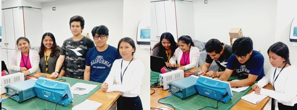
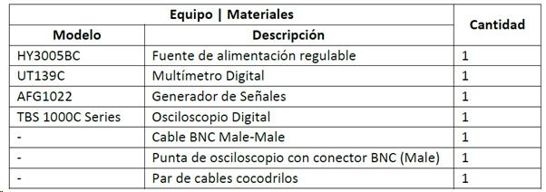

## Laboratorio N° 02

## **Introducción a los equipos e instrumentos de laboratorio**

**Imagen 1:** Representación fotográfica de los integrantes del grupo N° 02 

                                                                         Fuente: Elaboración  propia 

**Descripción:**

En el presente informe, se dará a conocer acerca de lo que se desarrolló en la sesión N° 3 del día 12/01/2024, en donde nos introducimos al conocimiento de los equipos y materiales del laboratorio, con los cuales se realizaron ciertas actividades que nos permitieron completar los objetivos propuestos para la presente sección que  a continuación pasan a ser más detallados.

### 1.MATERIALES E INSTRUMENTOS A UTILIZAR:

                                             
                                                                 Fuente: Guía de práctica N° 02

