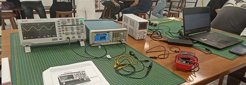

## Laboratorio N° 02

## **Introducción a los equipos e instrumentos de laboratorio**

**Imagen 1:** Representación fotográfica de los integrantes del grupo N° 02 

                                                     Fuente: Elaboración propia

**Descripción:**

En el presente informe, se dará a conocer acerca de lo que se desarrolló en la sesión N° 3 del día 12/01/2024, en donde nos introducimos al conocimiento de los equipos y materiales del laboratorio, con los cuales se realizaron ciertas actividades que nos permitieron completar los objetivos propuestos para la presente sección que  a continuación pasan a ser más detallados.

### 1.MATERIALES E INSTRUMENTOS A UTILIZAR:

                                           
                                                     Fuente: Guía de práctica N° 2

**Imagen 2:** Representación fotográfica de los materiales**

                                                     Fuente: Elaboración propia

### 2.PROCEDIMIENTO Y RESULTADOS:

**2.1 Uso del multímetro y fuente de alimentación:** 

En este paso hemos encendido la fuente de alimentación y hemos configurado a 5V y 1A, con ayuda de los cables de cocodrilos conectados al multímetro podemos tomar el voltaje. Para poder iniciar presionamos el botón Output, este nos permite habilitar la tensión de salida de la fuente, hemos realizado 10 mediciones empezando por la configuración de 5V hasta llegar a 14 V que es la medición final.

      
                                                                      
                                                      Fuente: Elaboración propia  
 

 
Las fórmulas utilizadas para el cálculo de los errores absolutos y relativos ubicados en la tabla 1 son las siguientes:

    

                                                        Fuente: Guía de práctica N°02 

Finalmente, con ayuda del excel se obtuvieron los promedios de los errores absolutos y relativos, acerca de las 10 mediciones realizadas expresadas en unidades de voltaje (V)  obteniendo como resultados 0.00085 y 0.00892 respectivamente, esto significa que el valor real en relación al valor medido fueron muy próximos.

**Tabla 01:** Resultados del error absoluto y error relativo del multímetro

                                                 Fuente: Elaboración propia
**2.2 Uso del generador de señales y osciloscopio:**   

**Imagen 3:** Evidencia de la conexión entre el generador de señales y el osciloscopio:

  

Después de haber realizado todo el procedimiento que nos muestra la guia, y haber conectado el generador de señales al osciloscopio, observamos que en un primer momento los resultados que nos aparecían en pantalla eran diferentes a los esperados.

Aunque la imágen no se aprecia muy bien, en la parte inferior derecha de la pantalla hay un valor de color amarillo: 320V.
La duda que teníamos en el grupo era por qué nos aparecía ese valor. Si bien en un primer momento creímos que era un problema de lectura por parte del osciloscopio, indagando más a profundidad y con ayuda de los profesores entendimos que aquel valor aparece debido a la escala que habíamos configurado con el botón de “Escala” correspondiente al “Canal 1”.  Ahora, ¿Que significa que aparezca aquel valor? Recordemos que en la pantalla del osciloscopio se muestran algunos cuadrados en el fondo, cada uno de ellos indican valores de voltaje predeterminados por nosotros, con el botón ya mencionado. Esto quiere decir, que los valores de dichos cuadrados van desde 2V y aumentando gradualmente según las preferencias de cada usuario, en nuestro caso, y debido a la falta de información, colocamos 320 V, ello quiere decir que uno solo de estos cuadrantes tenía ese valor. Teniendo claro ello, pudimos continuar con la toma de resultados.

**2.3 Partes de la pantalla de un osciloscopio:**   

  

**2.4 Tabla de valores ajustados de la grafica:**   
  

**2.5 Valores medios de la señal de entrada de un periodo:**   
  

**Imagen 4:** Evidencia de la amplitud de la onda
  

Descripción: En esta imagen, podemos observar la amplitud de Onda en KV (Aparece en dichas unidades debido a la escala que seleccionamos). Como se aprecia, tenemos una amplitud de onda de 10KV, más allá de las unidades, se puede decir que aquel valor concuerda con el voltaje del generador de señales debido a que

**Imagen 5:** Evidencia del periodo
  

Descripción: En esta otra imagen, se observa el tiempo en el que una onda tarda en completar un ciclo (Periodo), el cual tambien es valido debido ya que si aplicamos la formula para calcular la frecuencia (F) tomando en cuenta el periodo (F=1/P) nos dará 1 KHz, resultado similar al predeterminado en el generador de señales. 

