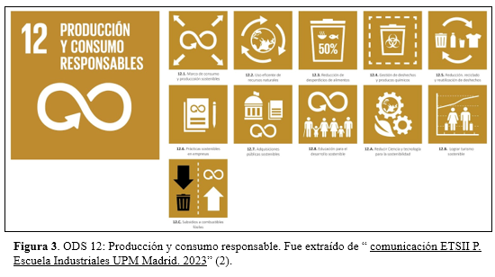

# **PROJECT_FdD** 


¡Hola a todos! En esta oportunidad nos complace compartir con ustedes el repositorio del grupo N° 02, el cual ha sido creado con la finalidad de almacenar y publicar el desarrollo de nuestro proyecto en el curso "Fundamentos de Diseño", esto permitirá contribuir desde nuestra posición como estudiantes universitarios en brindar alternativas de solución frente a problemas relacionados con el medio ambiente contribuyendo así a una comunidad más sostenible y responsable. Este repositorio no es simplemente un depósito de archivos, sino una ventana abierta a la creatividad, la colaboración y la innovación. Estamos emocionados de compartir nuestro progreso con la esperanza de inspirar y colaborar con otros que compartan nuestra pasión por un futuro más sostenible y equitativo.
 
*¿Quieres saber más sobre los participantes de este proyecto?*

[Sobre Nosotros](https://github.com/gcdavidq/Project_FdD/blob/main/FdD/Entregables/1.-Sobre_Nosotros.md)

# UNIVERSIDAD


# País
-Perú, Lima

# Proyecto:
----------------------------------
```python
print("En debate")

```


# OBJETIVO DE DESARROLLO SOSTENIBLE 


**ODS 12: PRODUCCIÓN Y CONSUMO RESPONSABLE** 

"Busca cambiar el modelo actual tanto de producción y consumo para lograr una gestión eficiente de nuestros recursos naturales".

**¿POR QUÉ LA ELEGIMOS?**

Se sabe que cada año se desperdician alrededor de 1.300 millones de toneladas de alimentos, mientras que 2.000 millones de personas padecen de hambre o desnutrición, lo que resulta ser algo paradójico debido a que al otro lado del mundo cerca de 2.000 millones de personas sufren de sobrepeso u obesidad. Del mismo modo, el sector de agricultura representa el 22% de las emisiones totales de gases de efecto invernadero (3).

Es por ello que dicho ODS tiene como objetivo promover el uso responsable y eficiente de los recursos naturales; esto nos permitirá trabajar enfocados en mejorar la calidad de vida, generando mejores ganancias a través de actividades económicas sostenibles.


### REFERENCIAS BIBLIOGRÁFICAS:

1.	Guía de Universidades en Perú - 2024 [Internet]. [citado 16 de enero de 2024]. Universidad Peruana Cayetano Heredia (UPCH) - Carreras y costos 2024. Disponible en: https://mentor.pe/universidad-peruana-cayetano-heredia-upch/

2. Comunicación ETSII P. Escuela Industriales UPM Madrid. 2023 [citado 16 de enero de 2024]. ODS 12: Producción y consumo responsables. Disponible en: https://www.escuelaindustrialesupm.com/etsii-upm/ods-12-produccion-y-consumo-responsables/

3. Moran M. Consumo y producción sostenibles [Internet]. Desarrollo Sostenible. [citado 16 de enero de 2024]. Disponible en: https://www.un.org/sustainabledevelopment/es/sustainable-consumption-production/


